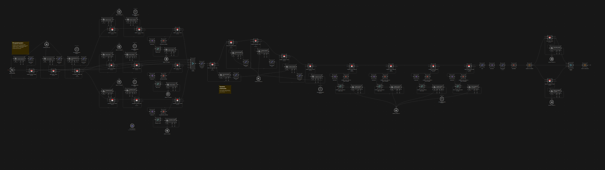
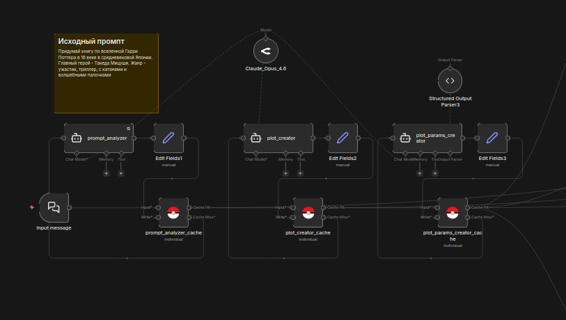
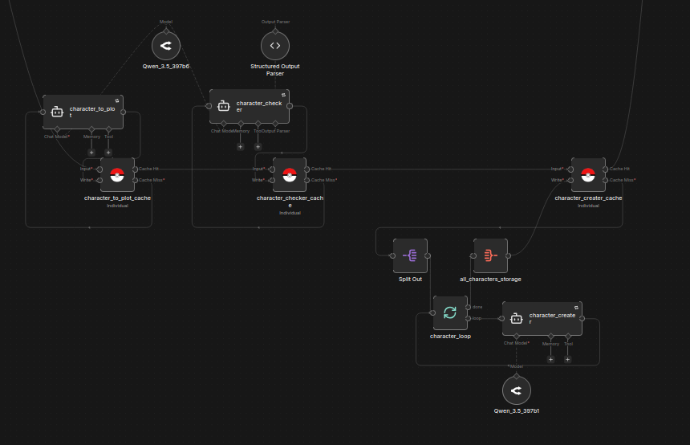
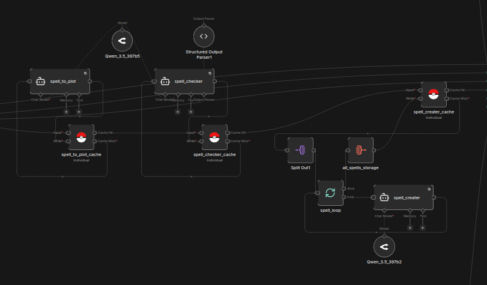
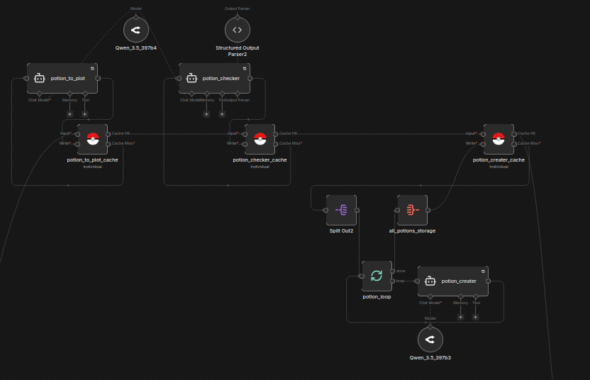
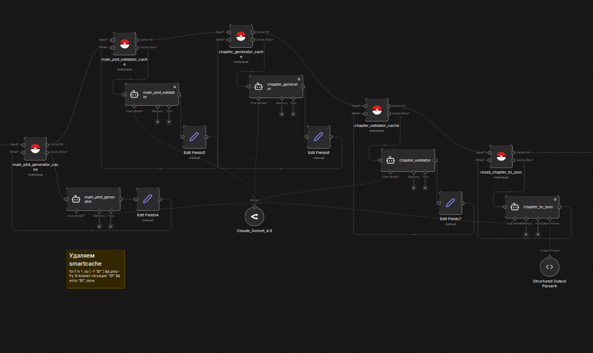
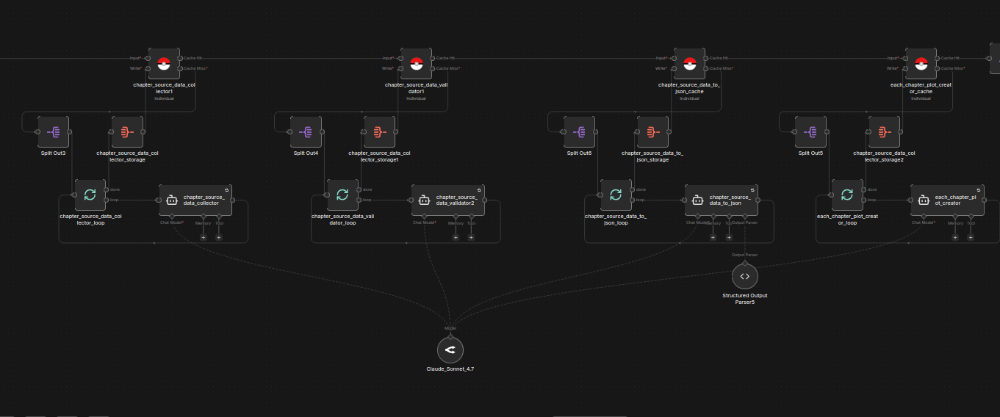
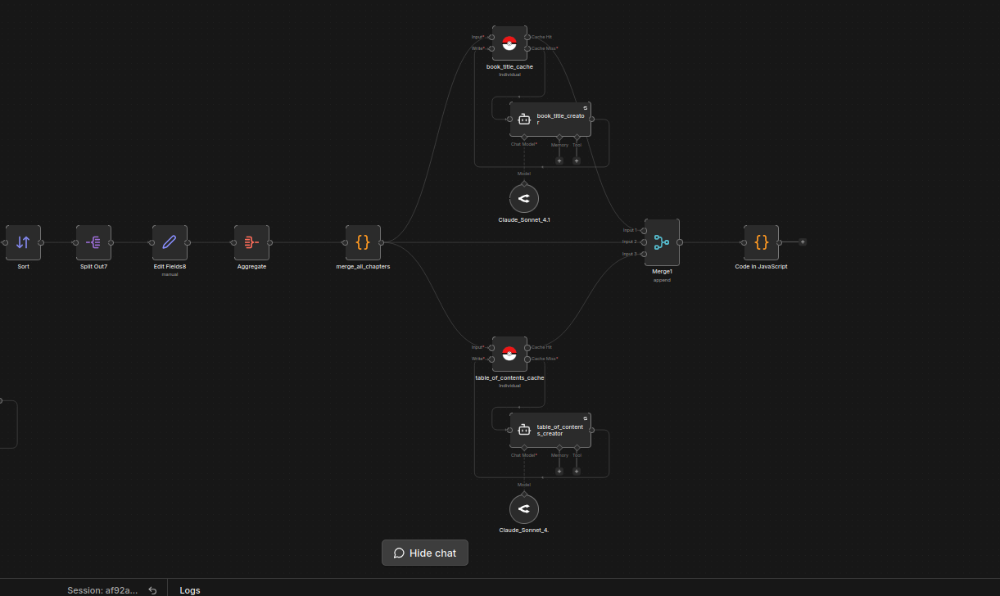

# Hogwarts_Story_Writer

Автоматизированный конвейер для генерации полноценной художественной книги по вселенной Гарри Поттера на основе одного пользовательского промпта. Проект реализован на платформе n8n и демонстрирует навыки построения сложных многоэтапных AI-пайплайнов, работы с контекстом больших языковых моделей и валидацией данных.

## 📖 О проекте

Проект решает творческую и техническую задачу: **генерация литературного произведения со структурой, внутренней логикой и целостным миром**. В отличие от простых чат-ботов, выдающих поток текста, данный workflow имитирует работу писательской комнаты и редактора.

Пользователь вводит идею в чат n8n (например: *«Расследование кражи философского камня в стиле нуарного детектива с Драко Малфоем в главной роли»*), и через несколько минут получает готовый `markdown`-файл с книгой, содержащей оглавление, проработанный сюжет, уникальных персонажей и артефакты.

Общая структура проекта доступна на скрине ниже. Видно плохо (*картинка приведена для отображения масштаба проекта*), поэтому ниже будут увеличенные скриншоты


## ⚙️ Архитектура рабочего процесса (Workflow)

Проект построен как последовательный конвейер (**pipeline**) в n8n, где каждая нода выполняет четкую функцию, передавая накопленный контекст в следующие этапы. Это обеспечивает управляемость и возможность отладки на любом шаге.

### Этап 1: Инициация и анализ
1.  **Чат-триггер n8n**: Принимает промпт пользователя.
2.  **Агенты-аналитики (3 штуки)**: Извлекает из запроса ключевые параметры (тема, главный герой, стиль повествования, настроение) и генерирует краткий логлайн будущей истории.


### Этап 2: Построение мира (World-building)
3.  **Создание персонажей**: Генерация ключевых персонажей с именами, внешностью, характером и мотивацией, строго соответствующими заданному сюжету - 3 агента.

4.  **Создание заклинаний**: Генерация уникальных заклинаний (или редких каноничных), которые будут играть роль в развитии сюжета - 3 агента.

5.  **Создание зелий**: Аналогично, генерация зелий, интегрированных в историю - 3 агента.


### Этап 3: Структурирование и драматургия
6.  **Генерация развернутого сюжета**: На основе логлайна и созданных сущностей пишется сюжет всей книги (экспозиция, завязка, развитие, кульминация, развязка).
7.  **Валидация сюжета (🧠 Критический AI-слой)**: Отдельный LLM-вызов проверяет сюжет на логические дыры и соответствие духу вселенной *Гарри Поттера*.
8.  **План глав**: Генерация оглавления и детального описания каждой главы. На этом этапе происходит **связывание данных**: AI получает полный перечень созданных персонажей/заклинаний/зелий и обязан упомянуть их в плане конкретных глав.


### Этап 4: Написание и верстка
9.  **Пошаговое написание глав**: Цикл или последовательный вызов AI для превращения плана главы в литературный текст (в выбранном пользователем стиле).

10. **Генерация названия**: Финальный штрих — яркое название книги, соответствующее стилю и сюжету.
11. **Сборка Markdown (Code Node)**: JavaScript-функция склеивает все главы книги, оглавление и название в один аккуратный файл.
12. **Формирование ответа**: Файл прикрепляется к последней ноде n8n.


## 🛠 Технологический стек и навыки

*   **Платформа**: n8n (Self-hosted).
*   **AI-модели**: Интеграция с Anthropic Claude Sonnet 4.7 (уклон на фантазию и креатив) и Qwen3.5 (уклон на техническую часть - парсеры)
*   **Управление контекстом**: Подстановка данных из предыдущих нод для поддержания каноничности вселенной на протяжении всей генерации.
*   **Обработка ошибок**: Реализованы повторные запросы (Retry on Fail).

## 📝 Пример промпта и итоговый результат:
**Промпт:**
```
Придумай книгу по вселенной Гарри Поттера в 16 веке в средневековой Японии. Главный герой - Такеда Мицуши. Жанр - ужастик, триллер, с катанами и волшебными палочками
```
**Результат доступен для прочтения тут:**  */created_books/Клинок, в котором молчат мёртвые.md*

## 🚀 Потенциальные доработки (Roadmap)

В текущей версии проект полностью выполняет заявленную функцию, однако логичным продолжением развития проекта было бы:

| Улучшение | Ожидаемый эффект |
| :--- | :--- |
| **Арки развития персонажей** | Отслеживание изменения отношения героя к другим и к себе по мере продвижения сюжета, генерация внутренних монологов. |
| **Валидация глав и связей** | Проверка на наличие всех обязательных сюжетных крючков в тексте глав (чтобы заклинание, упомянутое в плане, точно было использовано в тексте). |
| **Покадровая генерация** | Переход от уровня «Глава» к уровню «Абзац» для более точного контроля темпа повествования и объема. |
| **Итоговое ревью редактора** | AI-агент, оценивающий итоговый файл по чек-листу качества (динамика, логика, стиль) и вносящий точечные правки в конкретные главы. |
| **Отдельная проработка мира** | AI-агент, разрабатывающий описание мира, его "физику", правила, устройство и т.д. |
| **Отправка книги пользователю в чат** | Отдельная нода, отправляющая произведение в Телеграм-чат пользователю|

## 📦 Как запустить и проверить

Чтобы ознакомиться с проектом в действии:

1.  **Импорт Workflow**: Импортируйте файл `versions/HogwartsStoryWriter_v3.json` в n8n-проект.
2.  **Настройка Credentials**: Укажите свои API-ключи для сервиса OpenRouter. Для создания используются платные модели - убедитесь, что на счете хватает средств.
3.  **Запуск**: Активируйте Workflow и напишите сообщение в интерфейсе `n8n Chat`.

*Примечание: Генерация полной книги может занимать 1-2 часа, т.к. каждый персонаж, заклинание, зелье и глава прорабатываются отдельно*

*Проект выполнен в рамках углубленного изучения автоматизации и AI-оркестрации на базе open-source платформы n8n*
